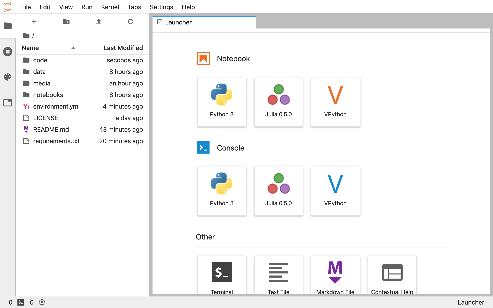

 <br>
 <br>
 <br>
[](https://twitter.com/rodo_ferro/) <br>
[](https://www.linkedin.com/in/rodolfoferro/) <br>
[](https://docs.google.com/presentation/d/e/2PACX-1vTnx_zuc9VT5rO9Fg0af-GjC589DuSoFGkFZH4Ekj32sY6LK18WeAyYBl_prXcN0ZD2HMRlSCDxfyj5/pub?start=false&loop=false&delayms=3000)


## About the workshop

In this workshop, we will create a service that uses a trained deep learning model, through a REST API. All with the power of Tensorflow 2.0, NumPy and Flask.

The idea will be to introduce what DLaaS is and train a neural network to solve a specific problem using Tensorflow 2.0 (with the Keras module) and Google Colab, after this, save the trained weights to load the architecture locally and mount the system through an API built with Flask.

This workshop requires intermediate-advanced knowledge about Python programming, especially with the use of scientific packages (NumPy and, if possible, Flask and Keras). Part of the objectives is that after the workshop there will be material and knowledge to develop AI models as a service; with Python, of course. For the workshop base code will be provided to start developing the service from that checkpoint.


## Contents

This workshop has been exclusively developed for its usage during **PyCon Colombia 2020**. The workshop should be self-contained, which means that with this explaining document should be enough to follow up and develop the complete contents.

As a summary, the complete content to be covered along the workshop is the following:
- A quick intro _(5 minutes)_
- Prerequisites and setup _(15 minutes)_
- Motivation (why is this relevant?) _(10 minutes)_
- Quick intro to the Deep Learning world _(30 minutes)_
- Web services → Let's build our API _(40 minutes)_
- Wrap up! _(5 minutes)_

You can find the Google Slides [**HERE**](https://docs.google.com/presentation/d/e/2PACX-1vTnx_zuc9VT5rO9Fg0af-GjC589DuSoFGkFZH4Ekj32sY6LK18WeAyYBl_prXcN0ZD2HMRlSCDxfyj5/pub?start=false&loop=false&delayms=3000).


## Setup instructions

All the code will be developed with Python 3.7 using [Tensorflow 2.0](https://www.tensorflow.org/), which adopts [Keras](https://www.tensorflow.org/versions/r2.0/api_docs/python/tf/keras) as the high level interface to build, train and deploy AI models.

#### Requirements:

* A laptop.
* This GitHub repository already cloned and updated before the workshop.
* A Python 3.6+ environment with Anaconda (suggested).
  * See options 1 and 2.
* A sense of adventure.

The workshop will be taught using *notebooks*, free-to-use documents with executable code, Markdown text, equations, visualizations, images and more. These notebooks can be created and executed on the cloud via Google Colab (option 1) or locally using your own computer through [Jupyter Notebooks or Jupyter Lab](https://jupyter.org/) (option 2). Also, a local IDE will be used for the AI model serving.

### Option 1: Google Colab

[Colab](https://colab.research.google.com) is a Google service that allows us to execute cloud-based *notebooks*. It provides Python 2 and 3 environments, with CPUs, GPUs and TPUs (for free!). You only need to have a Google account or create one.

I highly recommend you to choose an environment with Python 3 and GPUs. To activate it:

* Open the "`Runtime`" menu
* Choose the option "`Reset all runtimes...`"
* Open again the "`Runtime`" menu
* Choose the option "`Change runtime type`"
* Select Python 3 as the "`Runtime type`" and GPU as the "`Hardware accelerator`"

The following screenshot illustrates the process.


In [Colab](https://colab.research.google.com), you can create a new notebook, upload an existent one or import it directly from Google Drive or GitHub.

### Option 2: Local environment

I highly recommend you to have installed Python 3.7+ (**added to your PATH**), manage virtual environments, and install dependencies using [**Anaconda**](https://www.anaconda.com/).

1. Star and clone the repository:

   ```bash
   $ git clone https://github.com/RodolfoFerro/PyConCo20.git
   $ cd PyConCo20
   ```

2. To create a virtual environment with Python 3.7 using Anaconda, just run the following command:

   ```bash
   $ conda create --name pyconco20 python=3.7
   ```

   And to activate/deactivate the vitual environment simply run:

   ```bash
   # To activate
   $ conda activate pyconco20

   # To deactivate
   $ conda deactivate
   ```

3. To install dependencies listed in the `requirements.txt` file, just use `pip` to run installation as follows:

   ```bash
   (pyconco20)$ pip install -r requirements.txt
   ```

4. Now you should be able to write code! To open Jupyter Lab just run:

   ```bash
   (pyconco20)$ jupyter lab
   ```

That last command should open a new tab/window on your web browser, as in the following screenshot:



As in Google Colab, you can create a new notebook in the `New -> Python 3` option. To close the Jupyter Notebook you can press the `Quit` button and then close the tab or window of your web browser.

> **Extra:**
> If you want to have a nice-looking development environment with Jupyter Lab, I encourage you to install a nice theme. To do so, simply run in your terminal (with the virtual/conda environment activated):
> ```bash
> $ jupyter labextension install jupyterlab-tailwind-theme
> ```
> That's it. Now you should be able to activate the theme in your settings once you run your Jupyter Lab.

To download the dataset to be used:
```bash
mkdir data
wget -O data/fer2013.csv https://www.dropbox.com/s/zi48lkarsg4kbry/fer2013.csv\?dl\=1
```

## About the author

Rodolfo Ferro is a science and tech enthusiast and an experienced developer of tech solutions using automation, machine learning, web services, computer vision, web data extraction, and data analysis. Also, experienced in helping startups and entrepreneurs with the power of AI. An eternal learner.

Currently, he is the Community Leader at Codeando México, but he has also served as a tech consultant for his local government, worked as a remote developer and served as a research assistant in applied AI at the Mathematics Research Center, part of the National Consortium of Science and Technology in Mexico. He has also participated in a research project during a summer internship with the Aspuru-Guzik Research Group, in the Department of Chemistry and Chemical Biology at Harvard University, working with applied machine learning for molecular properties.

For several years, he has been actively participating in building AI and tech communities. He is a member of the GitHub Campus Experts community, he has also served as a Google Student Ambassador and as a core member in a GDG, among others.

Feel free to reach him out to start collaborating!

– [@rodo_ferro](https://twitter.com/rodo_ferro/)


### Atributions

- This repository contains a [MIT License](https://github.com/RodolfoFerro/PyConCo20/blob/master/LICENSE)
- I want to specially thank each person that made possible my participation in this event:
  - Sara and Noemí Martínez
  - Paola and Hiram Soria
  - Miguel Ángel Zetina
  - José Luis Badillo
  - Lizzeth Luevano
  - Andrea Nuño
  - Miguel Ángel Camacho
  - Abril Martínez
